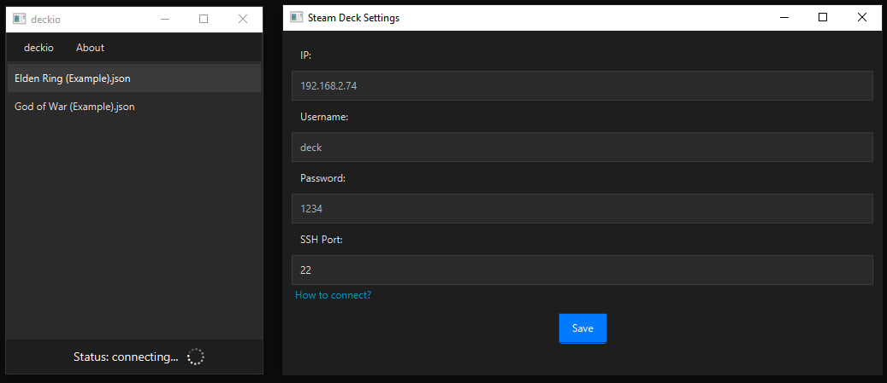

# deckio

**deckio** is a utility application designed to synchronize game saves between your PC and Steam Deck via SFTP. <br> It provides an easy-to-use interface for sending and receiving game saves, ensuring your progress is always up-to-date across your devices.

**Backups folder:** "deckio/backups"

---
<center>
<p align="center">
 
</p>

<p align="center">
 
</p>

</center>

# Install:

1) **Download** latest version from the [release page](https://github.com/e6aluga/deckio/releases)
2) **Unzip** the archive to your computer
3) **Open** deckio.exe

# Future updates:

* SFTP Explorer
* Automatic synchronization of saves in addition to manual ones
* Linux support
* Plugin for Steam Deck
* Custom CSS themes
* Cloud saves

# How to setup SSH on your Steam Deck:

1) **First, we need to set the superuser password**
1.1)  Switch to desktop mode
1.2) Open **Konsole** and write: 
```passwd```
1.3) Enter your password
p.s - [recover password](https://youtu.be/jWFjZNxFHew)

2) **Secondly, we need to activate the SSH service on the Steam Deck**
2.1) enable the sshd service
```sudo systemctl start sshd```
<br>
2.2) adding sshd to the startup (in game mode, it also works)
```sudo systemctl enable sshd```
<br>
3) **Finally, we need to find out the ip of the Steam Deck**
   3.1) **First method:** 
   Write in in **Konsole:**
    ```ip -c a```
    <br>
    where **{interfacename}** - Steam Deck Ip
    3.2) **Second method:** <br>
    Open your router's settings (usually **192.168.1.1**) and look at the Steam Deck Ip in devices