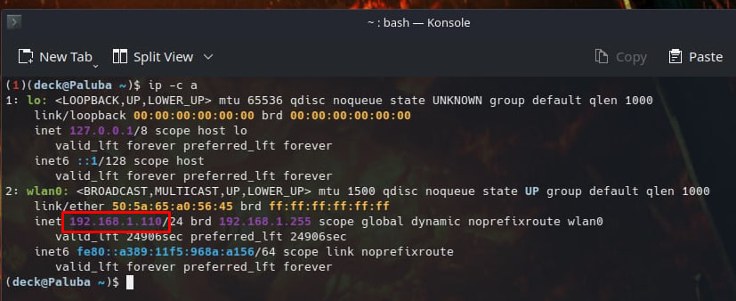

<p align="center">
  
</p>

<h1 align="center">deckio (beta)</h1>

<p align="center">
  deckio is a utility application designed to synchronize game saves between your PC and Steam Deck via SFTP.<br>
  It provides an easy-to-use interface for sending and receiving game saves, ensuring your progress is always up-to-date across your devices.
</p>

<p align="center">
  <a href="https://github.com/e6aluga/deckio/releases">Download</a>
</p>

---

<p align="center">
  
</p>

## Install:

1. **Download** the latest version from the [release page](https://github.com/e6aluga/deckio/releases)
2. **Unzip** the archive to your computer
3. **Open** `deckio.exe`

## Future updates:

* SFTP Explorer
* Automatic synchronization of saves in addition to manual ones
* Linux support
* Plugin for Steam Deck
* Custom CSS themes
* Cloud saves

## How to setup SSH on your Steam Deck:

1. **First, we need to set the superuser password**
   - Switch to desktop mode
   - Open **Konsole** and write:  
     ```bash
     passwd
     ```
   - Enter your password  
   p.s - [recover password](https://youtu.be/jWFjZNxFHew)

2. **Activate the SSH service on the Steam Deck**
   - Enable the sshd service  
     ```bash
     sudo systemctl enable sshd --now
     ```

3. **Finally, we need to find out the IP of the Steam Deck**
   - **First method:**
     - Write in **Konsole:**  
       ```bash
       ip -c a
       ```
     - where **wlan0** is the Steam Deck IP  
     <p align="center">
       
     </p>
   - **Second method:**
     - Open your router's settings (usually `192.168.1.1`) and look at the Steam Deck IP in devices
