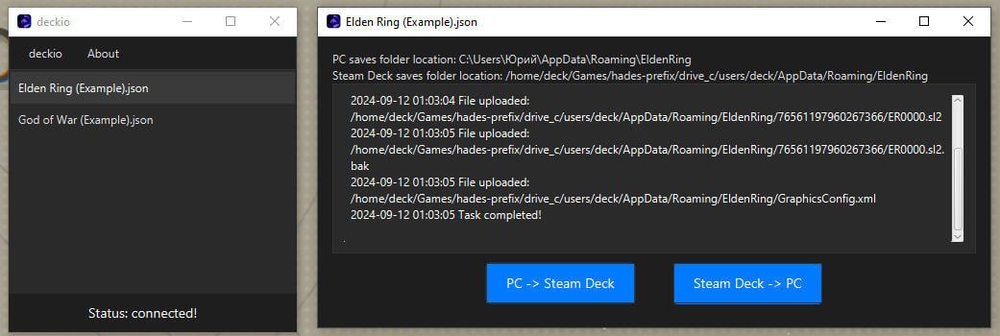

# deckio

**deckio** is a utility application designed to synchronize game saves between your PC and Steam Deck via SFTP.   It provides an easy-to-use interface for sending and receiving game saves, ensuring your progress is always up-to-date across your devices.

---

 

# Installation:

1) **Download** latest version from the [release page](https://github.com/e6aluga/deckio/releases)
2) Unzip the archive to your computer
3) Open deckio.exe

# How to setup SSH on your Steam Deck:

in progress...

1) [tutorial](https://gist.github.com/andygeorge/eee2825fa6446b629745ea92e862593a)
or
2) [Youtube Video](https://www.youtube.com/watch?v=IWgJrrrQn6I)